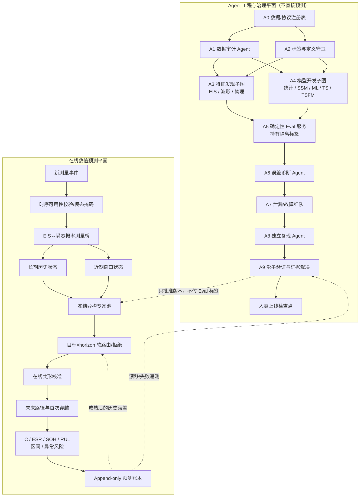

# 基于公开电容退化数据的多智能体在线剩余寿命预测系统

## 证据核验、候选设计与冻结实验方案

**项目代号**：AUDIT-Cap / TRACE-Cap（长期蓝图）  
**日期**：2026-07-29  
**阶段**：Idea / protocol freeze；正式 pilot 尚未获人类检查点批准  
**优先级**：真实未见电容与未见应力工况的数值预测精度第一  
**自动推进**：`AUTO_PROCEED=false`  
**保证状态**：同模型族外部审查只能给出 provisional 结论；没有数值实验结果，不能声明 submission-ready

---

## 摘要结论

当前最值得推进的不是“让多个 LLM 直接预测 RUL”，也不是立即实现全栈 TRACE-Cap，而是一个**审计门控的最小双平面系统**：

1. **数值预测平面**先只部署朴素、统计退化/KF、GPR/传统 ML 和删失正确的 C2 基线；每个新测量点到达后，用完整长期历史与近期窗口预测未来 C、ESR、SOH、条件可识别的 RUL、区间与异常风险。复杂专家只按逐项冻结实验晋级。
2. **Agent 工程平面**第一轮只比较 `single Agent + deterministic validator` 与 fixed typed DAG，负责数据审计、代码开发、误差诊断和证据核查；它不能读取未来 Eval 标签、不能用语言模型分数选择模型，也不在在线数值闭环中替代预测器。

查新与零上下文对抗审查后的实施顺序是：

1. **C2 Censored-Joint**：作为删失语义正确的必要强基线；事件不足时自动停用 RUL 主分析。
2. **C3 EC-Bridge**：若大包证明有足够 EIS—瞬态配对和协变量，则作为唯一主机制挑战者；只称“概率观测映射”，不称因果桥。
3. **C5 Agent-FE**：独立的隐藏故障 meta-eval。
4. **C4 Reject-TSFM**：后置正/负结果。
5. **C1 TRACE-Cap**：长期集成蓝图，不能作为首个实验。
6. **C6 Physics-CDE**：独立长轨迹证明足够后再评估。

这只是**审查后的实施先验**，不是性能结论。公开数据给出的最重要警告是：

- 完全可核验的 Stress-2 只有 6 只电容、每只 11 个点；
- 按 20% 电容量损失只有 5 个区间删失事件，4 个直到最后一个点才首次观测；ESR 阈值事件为 0；
- 真正的 10/12/14 V 原始包约 5.04 GB，当前只完成远程 ZIP/HDF5 格式核验，尚未完成全量 schema 和终止原因审计；
- 2024 年已经有电解电容“两阶段 Wiener + 在线自适应退化模型选择”，2025 年已经有薄膜电容“退化 + 生存 + Bayesian 在线更新”。这些不能再作为独立新颖点。

因此，第一篇可发表工作的最稳妥范围应是：

> 公开加速过压电解电容数据的可执行审计、区间/右删失标签和泄漏安全 prequential 基准；若配对审计通过，只增加一个简约 EIS—瞬态概率观测模型。RUL、生存、路由、TSFM 和多 Agent 的主张均服从识别门与数值测试。

---

## 1. 公开数据、论文与代码核验

完整证据、哈希、定义和最近邻见 [EVIDENCE_LEDGER.md](EVIDENCE_LEDGER.md)。

### 1.1 数据资源裁决

| 资源 | 核验结果 | 基准资格 |
|---|---|---|
| NASA “Towards Prognostics…” | 只有论文 PDF，没有 raw data | 文献，不是数据集 |
| NASA Stress-2 | `EOS_DataSet.mat`：11×6 的相对 C-loss 与 ESR-increase，单 10 V | 小样本 smoke/LOCO/删失基准 |
| NASA/PHM “Capacitor Electrical Stress” | 5.04 GB，ES10/12/14，MATLAB 7.3；EIS + 瞬态 | 主基准候选，须先全量审计 |
| Kaggle aging dataset | Stress-2 的重复副本，附带错误 MATLAB 解析 | 排除为独立数据；纳入审计陷阱 |
| 30 只湿热薄膜电容 | 论文曲线可见，raw 逐点数据未找到 | 不进入冻结公开基准 |
| Gao 2025 薄膜电容 RUL | 论文/预印本可得，raw 数据未找到，在线工具需认证 | 最近邻/强方法基线 |

### 1.2 Stress-2 的真实标签容量

按论文主定义 C-loss ≥20%：

- C2、C3、C5、C6：EOL 只知道位于 (171,194] h；
- C4：位于 (161,171] h；
- C1：到 194 h 仍只有 17.45% 损失，右删失；
- ESR 最大相对增幅 53.54%，没有达到 \(R/R_0=2\) 的事件。

所以小表不能合理支撑“每个点都有精确 RUL”的监督学习。正确做法是：

- C/ESR 多步轨迹预测可以在全部点计分；
- C-EOL 用 interval/right-censored likelihood 和生存 proper score；
- ESR-EOL 只能报告无事件和轨迹误差；
- 把文件最后一个循环当 EOL 或 `max_cycle-cycle` 一律判定任务定义失败。

### 1.3 开源代码审计的反例

`kino-6/capacitor-rul-prediction` 在审计提交中：

- 固定 `rul = 200 - cycle`；
- 固定 cycle 101–200 为异常；
- 八只 ES12 电容各截成 200 点；
- 固定 C1–C5/C6/C7–C8 train/val/test；
- 报告 MAE 1.95 cycles、R² 0.9753、F1 0.9975。

这些数字并不伪造，但测量的是“恢复预设周期倒计时”，不是按 C/ESR 物理阈值和删失定义的真实 RUL。它是本项目 leakage/label audit 的必测反例，不能作为可信 SOTA。

### 1.4 文献给出的硬边界

- NASA 早期工作已经使用经验退化模型、KF 和 leave-one-out；LOCO/KF 不是新意。
- Qin 2018 已有 Verhulst+指数、UKF-guided PF、PSO resampling。
- Zhao 2023 已有 Wiener + 相似性 + LSTM 残差。
- Chen 2024 已有两阶段 Wiener、三模型库、Bayesian 在线更新和历史 RUL 相似度选模。
- Gao 2025 已有薄膜电容混合效应退化 + proportional hazards + Bayesian 在线个体化。
- Ou 2024 已说明 C 与 ESR 会以不同速度退化，必须同时监测。
- Chronos、TimesFM、Moirai 和 Lag-Llama 只能作为受控专家；“用基础模型做电容”不自动构成技术创新。

---

## 2. 冻结定义

### 2.1 C、ESR 和 SOH

“容量”在本报告中只指电容量 \(C\)，不是电池 Ah。

\[
SOH_C(t)=C(t)/C_0,\qquad SOH_R(t)=R_0/R(t).
\]

阈值余量：

\[
m_C(t)=\frac{C(t)/C_0-\rho_C}{1-\rho_C},\qquad
m_R(t)=\frac{\rho_R-R(t)/R_0}{\rho_R-1}.
\]

主 NASA 协议取 \(\rho_C=0.8\)；ESR 敏感性协议取 \(\rho_R=2\)。复合 SOH 可为
\(\operatorname{clip}(\min(m_C,m_R),0,1)\)，但论文和 API 必须同时输出 \(SOH_C,SOH_R,m_C,m_R\)，不能用一个分数掩盖两种失效路径。

ESR 必须附带频率、温度、仪器/电路状态；条件未知时显式标记，禁止把不同测量条件当作同一真值。

### 2.2 EOL、删失与 RUL

主 EOL：

\[
T_C=\inf\{t:C(t)/C_0\le0.8\}.
\]

敏感性：

\[
T_R=\inf\{t:R(t)/R_0\ge2\},\qquad T_{\lor}=\min(T_C,T_R).
\]

若只在离散测量 \(t_{j-1}\) 未越界、\(t_j\) 越界，则
\(T\in(t_{j-1},t_j]\)，不是 \(T=t_j\)。未越界终止是右删失。

仅对条件事件定义：

\[
RUL(t)=T-t.
\]

同时报告小时和事件/循环单位。加速试验小时不能在没有加速映射的情况下解释成真实服役小时。

### 2.3 异常风险

异常不是“后 50% 生命周期”。冻结三类前瞻事件：

1. 未来 \(H\) 内首次 EOL 阈值穿越；
2. 预测创新超过训练侧滚动分布且持续 \(q\) 点；
3. EIS 与瞬态健康估计的跨模态不一致超过训练侧阈值。

阈值、\(H\)、\(q\) 和虚警预算只由内层训练/验证确定。

---

## 3. 候选生成与先验排序

并行生成账本见 [GENERATION_LEDGER.md](GENERATION_LEDGER.md)，机械去重和六个系统候选见 [IDEA_CANDIDATES.md](IDEA_CANDIDATES.md)。

### 3.1 30→21→6

- 三个独立分支各生成 10 个候选：数据/Eval、模型动力学、Graph Engineering。
- 按机制和 `dedup_key` 合并为 21 个模块。
- 组合成六个系统候选。
- 生成 Agent 没有参与排名。

### 3.2 审查后的 Pilot 前证据先验

| 实施顺序 | 候选 | 为什么先做 | 最大反证 |
|---:|---|---|---|
| 1 | C2 Censored-Joint | 先修复当前最严重的标签/删失错误；可解释且小样本友好 | Gao 2025 已覆盖核心方法；事件不足会使 RUL 不可识别 |
| 2 | C3 EC-Bridge | 最贴近原始数据独有的 EIS/瞬态结构，是唯一保留 `MEDIUM` 潜在增量的模块 | 缺少同步配对/温度/仪器元数据，观测映射不可识别 |
| 3 | C5 Agent-FE | 直接检验泄漏阻断和有效修复，可由隐藏故障产生独立任务 | 只提高研发可靠性；自建故障与验证器可能同构 |
| 4 | C4 Reject-TSFM | 能诚实回答“大模型何时有用/何时应拒绝” | 上下文过短、领域错配和预训练污染 |
| 5 | C1 TRACE-Cap | 作为所有模块通过后才考虑的长期架构 | 自由度远超器件数，全栈收益不可归因 |
| 6 | C6 Physics-CDE | 若大包有效事件足够，可能处理不规则多模态 | 自由度远大于独立电容数，极易过拟合 |

这是 same-family 零上下文查新与对抗审查后的证据先验，不是预测性能排名，也不是独立 jury 多数票。

---

## 4. 最佳可执行方案：审计门控最小系统与 TRACE-Cap 长期架构

### 4.1 双平面总览

下图是目标系统边界，不是第一轮全部启用的模型清单。首轮 champion 只包含简单数值模型和确定性验证器；图中 bridge、router、conformal、复杂 Agent 子图均有独立启用门。



### 4.2 在线数值平面

#### 启用门

| 模块 | 启用前提 | 失败后的默认 |
|---|---|---|
| C/ESR 简单预测 | parser、时间戳、LOCO 和单位测试通过 | 停止建模 |
| C2 删失 RUL | 终止原因可核验；事件/删失与设计仿真达到 Freeze B 精度门 | 只做 C/ESR，RUL=`NA` |
| C3 概率观测桥 | EIS—瞬态配对、可用时刻、器件身份和关键测量协变量足够 | direct-transient / direct-C/ESR |
| switching/route | 固定骨干上逐项、跨器件增益可重复 | 简单统计/KF champion |
| conformal | 有足够独立训练器件和合法成熟残差 | 模型原生区间 + `uncalibrated` |
| TSFM | 长度、独立器件、许可和污染说明通过 | 不加载 TSFM |
| 多 Agent | fixed 在隐藏任务、同成本优于 single | single + validator |

#### 输入事件

```text
MeasurementEvent {
  unit_id, condition_id, timestamp, aging_time,
  modality: EIS | transient | direct_C_ESR,
  raw_payload_hash, acquisition_metadata,
  causal_availability_time
}
```

任何缺少时间、器件或工况 ID 的记录先进入 quarantine，不能被模型静默吸收。

#### 概率观测桥

对同一训练电容的邻近时刻，学习：

\[
p(C_t,R_t\mid \tau_t,\phi^{EIS}_t,\phi^{wave}_t,V,T,\text{mode},u).
\]

- \(\phi^{EIS}\)：频率轴、复阻抗、等效电路参数与拟合协方差。
- \(\phi^{wave}\)：充/放电斜率、峰值、恢复时间、纹波、shape embedding。
- \(u\)：器件层级随机效应。
- 线上没有 EIS 时，只以瞬态和过去状态产生 C/ESR 分布；不会用未来 EIS 回填。
- 初始校准点是否可用是部署假设，必须作为两套 protocol 分开报告。
- “严格按可用时刻”只表示时间因果性，不是因果推断。若没有同步设计、干预或可识别假设，论文只称 measurement-error observation mapping。
- 必测负控包括时间趋势、时间置换、板卡/仪器分组和直接瞬态映射；若完整桥在负控下仍获同样优势，视为混杂而删除。

#### 长期/近期双通道

长期通道：

- 全历史层级两阶段 Wiener/样条；
- KF/UKF/PF/switching state-space；
- 联合退化—生存。

近期通道：

- 局部线性/GPR/XGBoost；
- TCN/N-HiTS/PatchTST；
- 可选 TSFM。

系统不强制单调。物理 soft penalty、hard projection 和不约束三者独立比较，以防真实电容量回升被抹掉。

#### 软路由

每个目标 \(y\in\{C,R,SOH,RUL,risk\}\) 和 horizon \(h\) 单独维护权重：

\[
w_{m,t}^{y,h}\propto
\exp\{-\eta L_{m,1:t-d_h}^{y,h}\}
\cdot g_m(z_t,p_{\mathrm{cp},t},a_t),
\]

其中：

- \(L\) 只包含已经成熟的过去 proper loss；
- \(d_h\) 是 h-step 标签延迟；
- \(p_{\mathrm{cp}}\) 是变化点概率；
- \(a_t\) 是模态可用性、上下文长度和 OOD 遥测；
- 禁止用当前未揭示真值或完整 Eval 汇总选择专家。

比较静态平均、Bayesian average、普通 Hedge、Chen 2024 型硬选模和变化点软路由。基础模型可被拒绝；上下文不足时回退统计冠军。

#### 概率输出

从混合未来路径计算：

- \(C_{t+1:t+H}\)、\(R_{t+1:t+H}\)；
- SOH 分量和阈值余量；
- \(T_C,T_R,T_\lor\) 首次穿越分布；
- 条件 RUL；
- 50/80/90% 区间；
- 未来阈值风险、创新风险和跨模态不一致风险。

在线共形校准按 C/ESR/SOH 的目标和 horizon 分开维护，只使用已经合法成熟的短期残差。RUL/生存的真实标签通常到 EOL/删失才成熟，LOCO 测试期校准器固定为内层训练器件版本，不能用测试器件终末结局回填早期预测。没有足够独立校准器件时输出 `uncalibrated` 和模型原生区间，不能伪称 coverage guarantee。

#### 安全回退

以下任一情况触发 champion fallback：

- 时间倒退、hash/schema 失败；
- 全部关键模态缺失；
- 路由输入 OOD；
- 区间校准持续失败；
- 模型版本/依赖不可重现；
- 路由器或 Agent 控制面崩溃。

回退模型优先为预注册的简单统计/状态空间冠军，而不是“另一个 LLM”。

### 4.3 Agent 工程平面的节点契约

这是允许扩展的节点全集。第一轮实现只启用 A0/A1/A2/A4/A5 与一个 single Agent；首个多 Agent 挑战者才启用固定 A1→A3/A4→A5→A7/A8 链。层级、辩论和动态拓扑必须逐级通过独立 meta-eval，不能因架构图更复杂而默认启用。

| 节点 | 可读 | 可写/提交 | 禁止 |
|---|---|---|---|
| A0 注册表 | 官方文件与协议 | manifest、hash、schema 版本 | 修改数据 |
| A1 数据审计 | raw + 元数据 | 审计报告、quarantine 清单 | 训练模型、看 Eval 结果 |
| A2 标签守卫 | 论文阈值、训练侧轨迹 | EOL/删失表、定义版本 | 用文件末尾补造 EOL |
| A3 特征子图 | 当前内层训练视图 | 带 lineage 的候选特征 | 读外层未来/Eval |
| A4 模型子图 | 训练特征与基线 | 代码、配置、模型 hash | 自报“更好” |
| A5 Eval 服务 | 隔离标签与预测账本 | 确定性数值报告 | 生成候选、改模型 |
| A6 诊断 | 训练/内层残差、门后报告 | 可执行误差假设 | 直接晋级 |
| A7 红队 | 候选包、故障注入器 | 反例、泄漏证据 | 以文本投票否决/通过 |
| A8 复现 | 干净环境与锁文件 | 独立运行 hash、差异 | 读取开发者隐藏缓存 |
| A9 影子裁决 | 数值门、成本、证据链 | `PROMOTE_CANDIDATE` 建议 | 自动替换冠军 |
| Human | 完整证据 | 最终批准/拒绝 | — |

所有边只传类型化 `EvidencePacket`：

```text
EvidencePacket {
  parent_hashes, data_manifest_hash, split_manifest_hash,
  code_commit, environment_lock_hash, feature_schema_hash,
  model_config_hash, seeds, prediction_ledger_hash,
  deterministic_metrics, known_failures, taint_status
}
```

语言模型文本只作为附件；没有数值字段或 taint 未清除的包不能进入下一门。

### 4.4 故障恢复

- 每个通过门的产物内容寻址并建立检查点。
- 失败只回滚受污染的后代子图。
- 同一节点两次重放不一致即熔断并请求人类。
- 数据/标签守卫、Eval 服务和影子裁决属于高关键节点，优先双执行或独立复现。
- 不使用 Agent 多数票判断两个数值产物谁正确；用哈希、单元测试、重跑和冻结 Eval。

---

## 5. 固定评测协议

完整可执行规范见 [FROZEN_EVAL_PROTOCOL.md](FROZEN_EVAL_PROTOCOL.md)。

### 5.1 两级基准

**Benchmark S**

- 6 折 LOCO，稀疏 10 V；
- 主要用于 parser、causality、删失和统计/滤波 smoke test；
- 不做 ESR-EOL RUL，不微调大模型。

**Benchmark L**

- 全量审计 ES10/12/14 后冻结；
- 电压内 LOCO；
- 三折 LOVO；
- 若批次元数据足够，再做 leave-one-batch/type-out。

“跨电压”只称 leave-one accelerated-stress voltage transfer，不夸大成跨真实工况或真实现场 domain generalization。

### 5.2 每点滚动回放

每个新事件到达：

1. 只读当时可用的历史前缀；
2. 全历史更新长期状态，最近 \(k\) 点更新短期状态；
3. 在标签揭示前保存多 horizon 预测；
4. 对应未来事件到达后才计分、更新校准或路由损失；
5. 继续到该电容轨迹结束；
6. 模型选择只用内层电容，外层按整只电容/电压隔离。

### 5.3 排名指标

不构造 LLM 综合分。当前冻结的是审计和分析分支；Benchmark L 在数据/设计门通过后、任何候选外层结果解封前，还必须补填唯一 `primary_endpoint / primary_horizon / primary_estimand / primary_comparison / noninferiority_bounds / tie_rule` 并封存分析容器。以下结果族全部报告，但不允许事后挑一个当主指标：

1. RUL/生存：MAE/MedAE/CRPS；含删失用 IPCW integrated Brier 与 log score。
2. C/ESR：每 horizon MAE/RMSE/MASE，先按电容、再按工况宏平均。
3. 区间：coverage、width、WIS/Winkler。
4. 异常：AUPRC、Brier、ECE、提前量和虚警。
5. 稳健/成本：最坏电容/电压、延迟、内存、重训/Agent 开销。

NASA Prognostic Horizon、α–λ、RA/CRA 为辅助，不替代原始误差。

### 5.4 统计推断

- 独立 cluster 是电容，不是窗口。
- Benchmark S 全部逐电容结果必须公开；exact sign/permutation 与 cluster bootstrap 只作描述，不能制造大样本假象。
- 随机模型至少 5 个种子。
- 多候选 Holm 校正。
- 提升必须满足 Freeze B 的唯一主指标，并通过 C/ESR 非劣、coverage 和最差应力电压门；若结论无法由锁定程序唯一决定，则输出“无冠军”。

---

## 6. 数据泄漏防护

### 6.1 十条硬失败

1. 在窗口生成后才按行随机切分。
2. 同一电容出现在训练和 Eval。
3. scaler/imputer/smoother 用了外层电容或未来段。
4. 用测试电容完整寿命的最大/最小/均值归一化。
5. 双向插值或平滑穿越预测原点。
6. 使用设备 ID、最终文件长度、最终循环数、终止标志或代理。
7. `RUL=max_cycle-cycle`。
8. 使用外层 Eval 做 early stopping、特征选择、prompt/Skill 修改或路由阈值。
9. 先看完整外层汇总，再继续修改同一版本并仍声称独立测试。
10. Agent 文本声称“无泄漏”但没有 lineage/权限/单元测试证据。

### 6.2 故障注入套件

冻结至少 30 个有真值缺陷：

- 时间窗口泄漏；
- 设备身份泄漏；
- 全寿命归一化；
- 未来 EIS 回填；
- Stress-2 的 C/aging_time 误解析；
- 相对百分比误标成 µF/Ω；
- horizon 偏一；
- 文件结尾伪 EOL；
- 测试驱动特征；
- 陈旧缓存和错误模型 hash。

比较静态规则、单 Agent、固定多 Agent、层级、可执行辩论和动态路由的发现率、误修率、错误晋级率及成本。任务需按数据集、故障家族和代码模块划分 hidden meta-test，防止验证器只识别自己编写的故障。

---

## 7. 模型与系统消融

### A. 数据/标签

| 消融 | 问题 |
|---|---|
| 精确首次观测 EOL vs 区间删失 | 伪精确标签造成多大偏差 |
| 20% C vs ESR×2 vs OR | 模型排序是否依赖阈值 |
| 全寿命归一化泄漏对照 | 漂亮结果有多少来自未来 |
| 原始解析 vs 审计解析 | 数据修正是否改变排名 |

### B. 测量与特征

| 消融 | 问题 |
|---|---|
| 只 C/ESR | 最低健康量基线 |
| 只 transient τ | 在线简单基线 |
| 固定线性 EIS↔transient 校正 | 概率桥是否真有必要 |
| 等效电路参数，无协方差 | 传播拟合不确定性的价值 |
| 频谱 encoder | 学习特征是否跨器件/电压 |
| EIS-only / transient-only / fusion | 各模态的独立贡献 |

### C. 退化模型

| 消融 | 问题 |
|---|---|
| last value / local drift | 所有复杂模型最低门 |
| 单阶段指数/KF | NASA 经典基线 |
| 两阶段 Wiener + similarity hard selection | Chen 2024 最近邻 |
| hierarchical no-switch vs switch | 阶段切换贡献 |
| KF vs UKF vs PF（同状态方程） | 滤波算法而非模型混淆 |
| 轨迹-only vs survival-only vs joint | 联合建模贡献 |
| long-only vs short-only vs static mix vs online mix | 双通道/在线权重贡献 |

### D. 路由与大/小模型

| 消融 | 问题 |
|---|---|
| oracle hindsight（仅上界） | 可实现路由离理论上界多远 |
| static average | 多样性基础收益 |
| Hedge without change point | 变化点本身的贡献 |
| hard switch vs soft route | 选择稳定性 |
| 去掉 TSFM | 基础模型是否提供任何净增益 |
| TSFM zero-shot vs head vs LoRA | 适配收益/过拟合 |
| no abstention | 拒绝机制是否避免短上下文失败 |

### E. 不确定性与异常

| 消融 | 问题 |
|---|---|
| native interval | 模型原生校准 |
| static conformal | 在线性是否必要 |
| ACI vs AcMCP/目标×horizon | 多步自相关处理 |
| 单 residual risk vs multimodal disagreement | 异常提前量来源 |

### F. Agent Graph

| 消融 | 问题 |
|---|---|
| single Agent | 最强简单基线 |
| fixed typed DAG | 权限/类型边价值 |
| + hierarchical fault domains | 恢复与监督成本 |
| + executable debate | 可执行反例价值 |
| dynamic topology | 是否值得路由成本 |
| 去掉 taint、独立复现、shadow gate | 各治理边的真实贡献 |

任何消融都共享完全相同的外层预测账本；不能换 split 后比较。

---

## 8. 实验路线与人类检查点

### Phase 0 — 已完成：证据与小文件可行性

- 核验官方/镜像资源；
- 下载并哈希 Stress-2；
- 确认 11×6 相对 C/ESR 语义；
- 统计 5 个 C-EOL 区间事件、1 个右删失、0 个 ESR-EOL；
- 远程核验 5.04 GB ZIP、三 MAT 文件和 MATLAB 7.3；
- 审计一个公开 GitHub 的伪 RUL 标签；
- 生成 30 个候选并机械去重；
- 冻结 Eval v0.2（审计前分支协议）。

### Human checkpoint H0 — 当前停止点

批准前不启动正式数值实验。需要确认：

1. 是否下载 5.04 GB 包并预留约 15–40 GB 解压/索引、30–100 GB 特征缓存；
2. 是否接受主研究范围优先做“数据/Eval + 简单 C/ESR 概率预测 + 条件删失 RUL + 条件测量桥”，把全栈路由、TSFM 和 Agent 拓扑优化放到后续或独立论文；
3. 是否批准 `FROZEN_EVAL_PROTOCOL.md` 的主 EOL、LOCO/LOVO 和指标。

### Phase 1 — 数据冻结

- 全量下载、哈希、对象树和事件表；
- 器件身份与跨资源重复检查；
- 时间/终止原因/测量条件审计；
- 输出 `DATA_MANIFEST.json`、`EVENT_TABLE.parquet`、`LABEL_LEDGER.csv`；
- 人工抽样复核。
- 按真实独立器件、事件、删失、配对与相关结构做设计仿真，估计选择错误率、最小有意义效应的检出能力和置信区间宽度；
- 在不看候选外层结果的情况下补填 Freeze B 唯一主分析行并封存容器。

**Go/No-Go G1**：若不能可靠映射器件、时间、终止原因、EIS 与瞬态，则相应 C3/RUL 分支停止，只保留可审计健康量子集。若设计仿真不能区分最小有意义效应，不作模型优越性排序。

### Phase 2 — Eval harness 与朴素基线

- 实现 append-only prequential ledger；
- 重现 Stress-2 阈值与删失；
- last value、drift、指数/KF、两阶段 Wiener；
- 时间可用性/分组/单位/标签单元测试；
- 跑泄漏对照验证 harness 能识别虚高结果。

**Go/No-Go G2**：朴素基线不能稳定复现或 Eval 账本未通过 taint test，则禁止任何复杂模型。

### Phase 3 — 最小精度模型对比

按顺序添加：

1. last-value/drift；
2. 一个经典统计退化或 KF 基线；
3. GPR 或一个传统 ML 强基线；
4. Chen 2024 型最近邻；
5. C2：删失/终止识别通过时的正确 RUL 强基线；
6. C3：配对/协变量/功效门通过时唯一新增机制。

每次只引入一个新自由度并走完整内层选择。

**Go/No-Go G3**：C3 必须在固定骨干、相同折/原点上相对 direct-transient 与简单测量误差基线产生跨器件一致的 C/ESR proper-loss 增量；若 RUL 可识别，再把下游 RUL 作为次要结果。失败则删除方法新颖性主张，转为可复现 benchmark/negative result。

### Phase 4 — 后置模型与独立 Agent meta-eval

- TSFM zero-shot/适配/拒绝；
- 30+ 植入故障的 Agent meta-eval；
- `single → fixed → hierarchical → debate → dynamic` 逐级晋级，前一级无优势即停止；
- 冻结冠军—挑战者影子回放。

**Go/No-Go G4**：fixed 若在隐藏任务、同成本下不能提高缺陷阻断/有效修复并控制误拒，停止更复杂拓扑。预测精度只是记录完整候选中介链后的次要结果；生产方案默认 single + deterministic validator。

### Phase 5 — 独立复现与影子

- 干净环境从 raw hash 到全部表/图；
- 独立 reviewer 不读取开发缓存；
- 完整 shadow replay；
- 人类最终裁决。

---

## 9. 复现要求

### 9.1 必交产物

- 原始 URL、下载时间、字节数和 SHA-256；
- 数据许可/访问说明；
- HDF5 object tree 和字段数据字典；
- 器件/工况/事件/删失清单；
- split manifest；
- 每个预测原点的输入 hash、模型 hash、输出和标签成熟时间；
- 完整配置、随机种子和环境锁；
- 训练/推理资源与时延；
- 每电容/电压/阶段结果，不只给总体均值；
- 失败运行和排除理由；
- Agent prompt、权限、工具调用、补丁和证据包；
- 论文表图生成脚本。

### 9.2 版本固定

- OS/container digest；
- Python 与数值库；
- GPU/CUDA/cuDNN；
- Chronos/TimesFM/Moirai/Lag-Llama 的代码 commit 和权重 revision；
- 全部传统模型库版本；
- deterministic/non-deterministic 操作清单。

### 9.3 许可

- NASA/PHM 原始数据按页面声明记录；
- 第三方 Kaggle 副本不重新分发替代官方源；
- `kino-6` 仓库在审计提交没有许可证文件，不直接复制代码进入复现包；
- 每个预训练模型遵守各自 license/weight terms。

---

## 10. 新颖性定位

### 10.1 不能声称

- 首个电容在线 RUL；
- 首个电容两阶段模型/动态选模；
- 首个 KF/UKF/PF 或深度 RUL；
- 首个联合退化—生存电容模型；
- 首个同时估计 C/ESR；
- 首个 RUL conformal interval；
- “首个多 Agent 做电容”作为充分方法贡献。

### 10.2 可检验的潜在贡献

1. 发布可机器重建的 NASA 电容数据语义、标签、终止/删失与泄漏审计，以及统一 prequential LOCO/留一应力电压协议；这属于领域基准贡献，不预设“首个”。
2. 若配对审计通过，在同一公开实验内把稀疏离线 EIS 与在线瞬态作为有偏测量源，显式区分器件状态和测量偏差、输出概率观测分布，并把不确定性传播至阈值风险。只主张留出预测增量，不主张因果识别。
3. 将 C2、切换状态、动态路由、联合生存、共形和 TSFM 作为已有方法的严格对照或工程组件；除非公式/识别假设和 add-one 实验证明独立增量，不列为新颖点。
4. 将 Agent 贡献定义为“隐藏缺陷阻断、有效修复、误拒、恢复和成本”，而不是 LLM 文本质量；这是独立 meta-eval，不预设提高物理预测精度。
5. 可能最有价值的是负结论：小样本下统计/状态空间模型何时系统性胜过 TSFM/复杂 Agent，以及泄漏协议为何能颠倒排行榜。

### 10.3 投稿定位

最安全的标题方向：

> Leakage-Safe Prequential Prognostics for Electrolytic Capacitors: Audited Public Data, Censored Outcomes, and a Probabilistic EIS–Transient Observation Model

“multi-agent”更适合做独立 systems/evaluation 子贡献，除非 Agent topology meta-eval 在隐藏任务和固定预算下产生明确数值收益。

---

## 11. 对抗审查与可允许主张

两名零上下文 fresh reviewer 已完成查新和对抗审查；二者均为 OpenAI same-family，因此结论为 `provisional`，不能满足 submission assurance 所需的 cross-family 独立性。完整审查工件见 [NOVELTY_REVIEW.md](NOVELTY_REVIEW.md) 和 [ADVERSARIAL_REVIEW.md](ADVERSARIAL_REVIEW.md)。

### 11.1 查新结论

| 核心主张 | 查新裁决 | 可允许的窄主张 |
|---|---|---|
| A. EIS—瞬态观测桥 | `MEDIUM` | 对有偏测量源做可识别概率校准，并把不确定性传播到 C/ESR/阈值；不能称首次关联或一般因果识别 |
| B. 层级双状态/切换 RUL | `LOW` | 电容领域实例与适用边界；Wen 2018、双变量两阶段与 Chen 2024 已覆盖核心组成 |
| C. 变化点、目标×horizon 路由/拒绝 | `LOW` | 带延迟标签的电容实现与失败边界；在线 proper-score 聚合、Kairosis、TimeRouter 已有强近邻 |
| D. 联合删失、多输出、共形 | `LOW` | 统一标签接口和极小样本适用边界；Gao 2025 与删失共形已有核心方法 |
| E. 类型化 Agent DAG/血缘/影子门 | `LOW` | 电容 PHM 的可执行治理基准；AgentEval、Curie、MLE-bench 和 provenance 已覆盖一般机制 |

查新总建议为 `PROCEED_WITH_MAJOR_REPOSITIONING`：定位为“测量科学 + 严格电容 PHM 基准”，而不是五项均新的统一算法。

### 11.2 对抗审查的决定性问题

对抗 reviewer 给出 `PROCEED_WITH_MAJOR_REDESIGN`，其中四项为当前 CRITICAL：

1. Benchmark L 还不是数值上已定义的基准：独立器件、模态配对、事件映射和终止结局未知。
2. 有效样本量按物理电容计；窗口、频点、预测原点和随机种子都不能扩大独立样本量。
3. 物理 EOL、点 RUL 和生存分布可能不可识别；未知终止可能是信息性删失，局部回升使首次越界对噪声敏感。
4. RUL 标签直到 EOL/删失才成熟，原协议若按 \(t+h\) 更新会造成回顾性或跨器件泄漏。

主要修正已经写入 v0.2：

- Data Gate + design simulation + 结果解封前的 Freeze B；
- RUL 校准器在 LOCO 测试期固定，只由内层训练器件拟合；
- LOVO 一律称“留一加速应力电压迁移”；
- “因果桥”改为概率观测映射并增加时间/板卡/仪器负控；
- 只保留一个主机制、一个固定骨干和一个主要对比；
- Agent 拓扑拆成独立 meta-eval，先 single、后 fixed，逐级晋级；
- 外层只由隔离执行者一次解封；同一数据上的解封后修改只能标探索性。

### 11.3 审查后的主张矩阵

| 实验结果 | 允许主张 | 禁止主张 |
|---|---|---|
| 只有 Benchmark S 改善 | 对 6×11 10 V 稀疏表可行 | 泛化到真实现场/跨工况 |
| LOCO 改善，LOVO 失败 | 同应力电压跨器件有效 | 跨应力电压或现场泛化 |
| LOVO 改善，C3 bridge 无收益 | 留一加速应力电压迁移有效 | 测量桥是精度来源、真实跨工况 |
| bridge 改善 C/ESR，不改善 RUL | 概率健康量估计改善 | RUL 提升、因果损伤识别 |
| TSFM 被持续拒绝 | 公开数据下 TSFM 无条件价值不成立 | 基础模型普遍无用 |
| Agent 降低泄漏但不提精度 | 工程治理/安全收益 | 多 Agent 提高预测精度 |
| 全 TRACE 改善且 add-one 一致 | 该公开协议下各已验证组件有效 | 未见器件类型/真实服役普适 SOTA |
| RUL 识别门失败 | C/ESR 轨迹和数据限制结论 | 点 RUL、校准生存或阈值寿命优越性 |

### 11.4 同行审查后的 Agent 顺序

`single → fixed → hierarchical → executable debate → dynamic`。fixed 若在隐藏任务同成本不优于 single，立即停止更复杂拓扑；多 Agent 的主要结局是缺陷阻断、有效修复、误拒、错误晋级、恢复和成本，最终预测误差只是记录完整中介路径后的次要结局。

---

## 12. 当前裁决

**建议**：`PROCEED WITH MAJOR REDESIGN TO DATA AUDIT AFTER HUMAN APPROVAL`。

允许推进的只是数据审计与最小基线，不是全栈系统。理由是：

- 数据独有的 EIS/瞬态结构可能支持一个明确、可证伪的概率观测模型，但是否可识别尚未核验；
- 两阶段/模型选择最近邻提供强而不是弱的对照；
- 小表已证实删失和标签语义是不可绕过的问题；
- 审计与设计仿真具有明确的自动降级/停止条件；
- Agent 部分可用隐藏故障和 frozen numerical Eval，不依赖主观评分。

**当前没有完成**：

- 5.04 GB 原始包全量审计；
- 任何正式模型训练；
- LOCO/LOVO 数值结果；
- pilot 排名确认；
- cross-family 独立审查；
- submission-ready 结论。

因此，`assurance: submission` 当前未满足；阻断项是正式 pilot、Benchmark L 全量审计和 cross-family reviewer，而不是语言模型信心不足。

---

## 参考入口

- [NASA Stress-2](https://data.nasa.gov/dataset/capacitor-electrical-stress-2)
- [PHM Society NASA datasets](https://data.phmsociety.org/nasa/)
- [Celaya et al. 2011](https://c3.ndc.nasa.gov/dashlink/static/media/publication/2011_AIAATowardsCapacitors.pdf)
- [Renwick et al. 2015](https://www.papers.phmsociety.org/index.php/phmconf/article/view/2713)
- [Qin et al. 2018](https://doi.org/10.1016/j.microrel.2018.05.020)
- [Zhao et al. 2023](https://doi.org/10.1016/j.microrel.2023.114928)
- [Chen et al. 2024](https://doi.org/10.1016/j.microrel.2024.115509)
- [Ou et al. 2024](https://arxiv.org/abs/2404.13399)
- [Gao et al. 2025](https://doi.org/10.1109/TPEL.2025.3621772)
- [Wen et al. 2018: multiple-change-point degradation](https://doi.org/10.1016/j.ress.2018.04.005)
- [Kairosis 2025](https://doi.org/10.1016/j.ijforecast.2025.03.001)
- [TimeRouter 2026](https://arxiv.org/abs/2606.11625)
- [Doubly Robust Conformalized Survival Analysis](https://arxiv.org/abs/2412.09729)
- [AgentEval 2026](https://arxiv.org/abs/2604.23581)
- [Curie 2025](https://arxiv.org/abs/2502.16069)
- [NASA prognostic metrics](https://ntrs.nasa.gov/citations/20100023445)
- [Chronos](https://arxiv.org/abs/2403.07815)
- [TimesFM](https://arxiv.org/abs/2310.10688)
- [Moirai](https://arxiv.org/abs/2402.02592)
- [MLE-bench](https://arxiv.org/abs/2410.07095)
- [Multi-agent automated research study](https://arxiv.org/abs/2603.29632)
